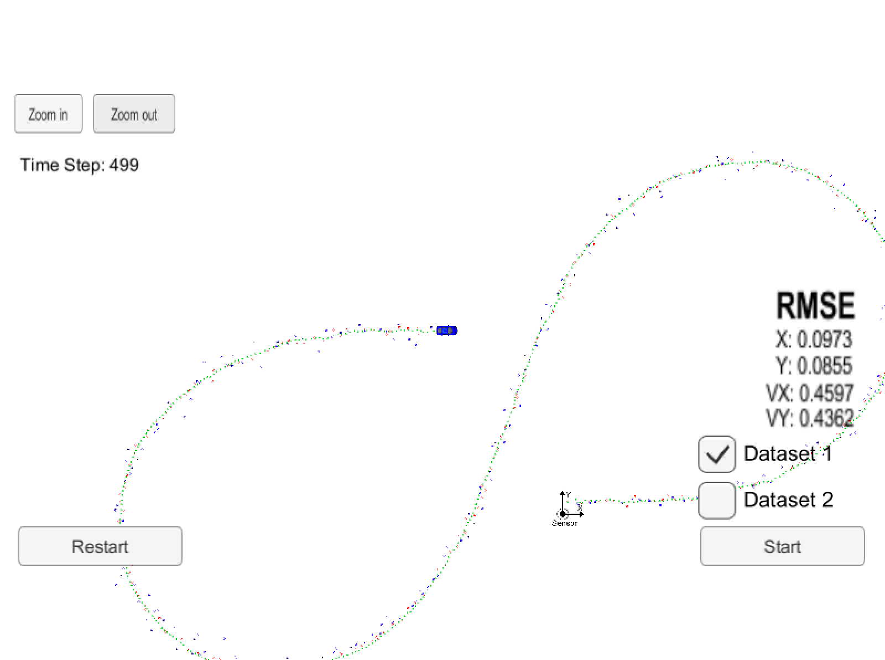
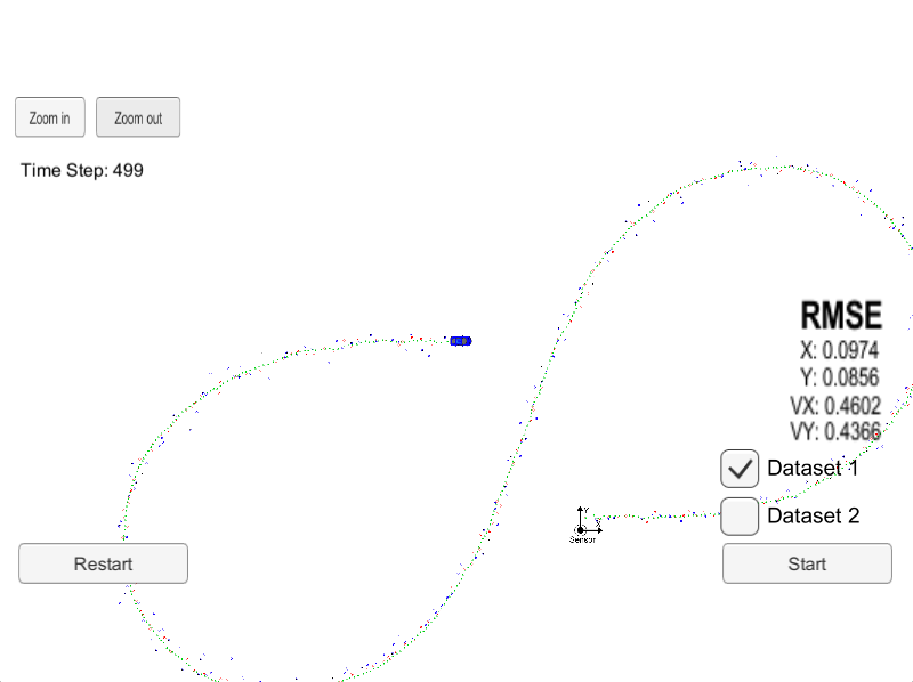
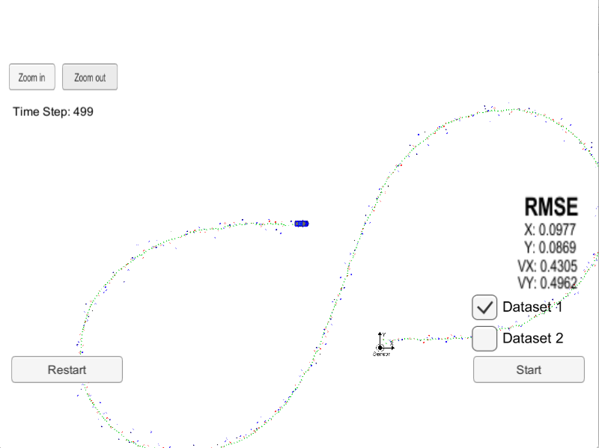
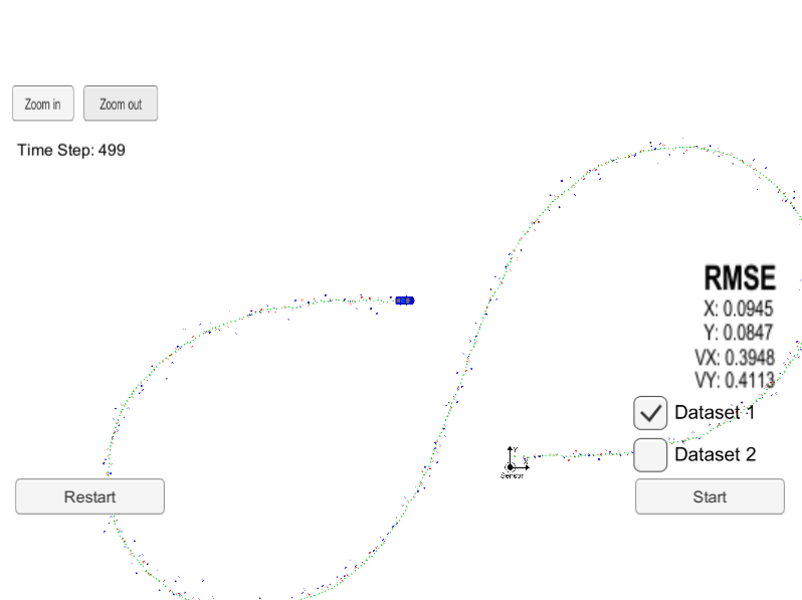
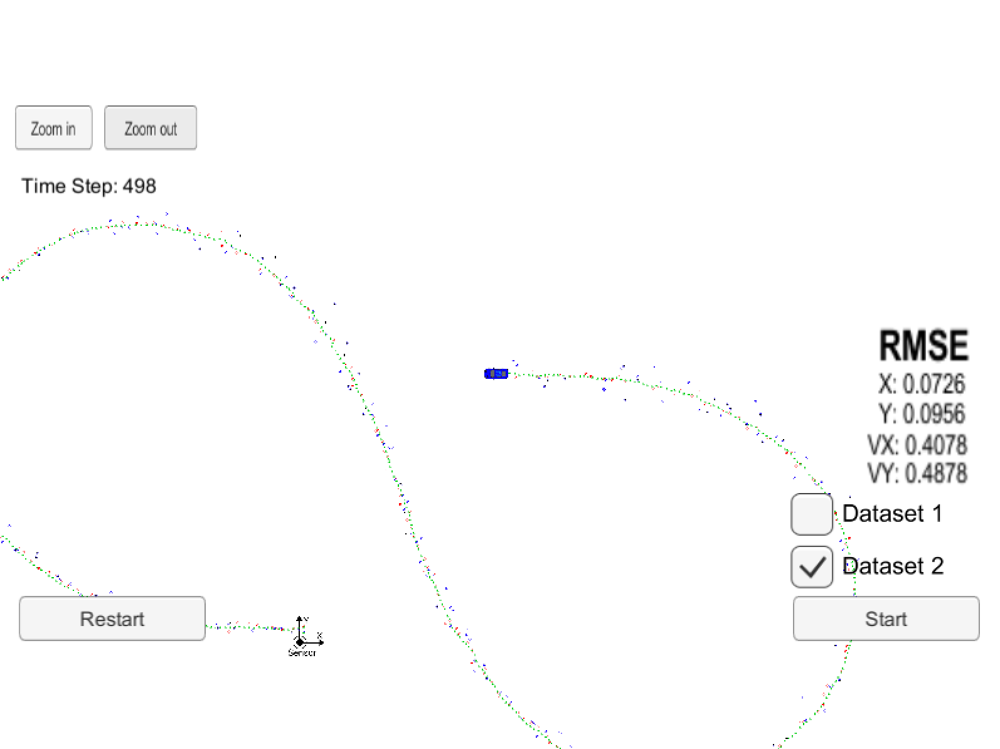

# Extended Kalman Filter Project: Car Tracking and Sensor Fusion 

## Table of Contents: ##
- [Objective](#objective)
- [Results](#results)
- [How to build and run the code](#howto)
- [Code Flow](#codeflow)
- [References](#references)

## Objective: 

The objective of this project was to use both a regular and Extended kalman Filter for tracking the position 
and velocity of a car using both LIDAR and RADAR measurements. These algorithms can of course be used to track any 
dynamic objects whose positions and/or velocities can be measured.

## Results: 

Starting with the sample/template code in the project repo [1], I developed and tested several versions of the KF and EKF. I began by implementing the standard KF and EKF using the standard update formula for the state error covariance. Next, I added a flag "use_joseph_form_" in kalman_filter.h so that the covariance updates are performed using the Joseph form, which does a much better job than the standard form of ensuring that the error covariance matrix remains a symmetric positive definite matrix [2]. Next, I added a flag "numIterations" to FusionEKF.h so that a value of numIterations=1 corresponds to a standard EKF while numIterations > 1 corresponds to a fixed iteration version of the Iterated Extended Kalman Filter [3]. Finally, I added a flag "sequential_measurement_updates" to FusionEKF.h so that when set the algorithm processes each measurement sequentially rather than all at once. The advantage of doing this is that the matrix inversion that is required for normal KF/EKF gain calculations gets replaced by a scalar division. We can use sequential measurement processing in this problem since the measurement noise covariance matrix is a diagonal matrix.
	
The results for each approach on Dataset 1 in the simulator are shown below. Note that there was very little difference between the EKF and the IEKF, or between the standard and Joseph forms, but using sequential measurement processing provided the best results.
   
- Baseline: Dataset 1
 

- Joseph Form: Dataset 1
 

- Iterated EKF, one extra iteration: Dataset 1
 

- EKF with sequential measurement processing: Dataset 1
 

- EKF with sequential measurement processing: Dataset 2
 

## How to build and run the code: 

	Perform the following steps:

	- Clone this repo: **git clone https://github.com/westofpluto/udacity-sdc-ekf.git**
	- Enter into directory: **cd ~/<repository>**
	- Make build directory: **mkdir build && cd build**
	- Compile the code: **cmake .. && make**
	- Run the code: **./ExtendedKF **
	- Start and run term2_sim. On my Mac, this is called term2_sim.app. This simulator can be found here: https://github.com/udacity/self-driving-car-sim/releases
	
## Code Flow: 

The main driver for the code is main.cpp, which was provided as part of the initial repository - I did not aletr that code at all. The main.cpp file instantiates a FusionEKF object and calls the ProcessMeasurement method when new measurements are available. The FusionEKF class instantiates a KalmanFilter object, which initially had methods Predict, Update and UpdateEKF. I added methods UodateSingle and UpdateEKFSingle to handle sequential measurement processing. 
	
The code flow is as follows:
	- For the first data point, the FusionEKF ProcessMeasurement method uses the measured values as initial state estimates. It also creates an initial value for the state error covariance matrix.
	- Whenever a new data point is available after that, the ProcessMeasurement function first calls Predict() to propagate the state and error covariance matrix from the prior timestep to the current time.
	- Next, if the measurement was from LIDAR, it uses the Update() method to update the state and error covariance matrices. If we are using sequential measurement processing, it uses UpdateSingle() for each component of the measurement vector instead.
	- If instead the measurement was from RADAR, it first calculates the Jacobian matrix (partial of h(x) with respect to x), and then calls UpdateEKF() to update the state and error covariance matrices. If we are using sequential measurement processing, it uses UpdateEKFSingle() for each component of the measurement vector instead.

## References: 
	1. Udacity Self Driving Car Extended Kalman Filter Project repo: https://github.com/udacity/CarND-Extended-Kalman-Filter-Project
	2. Kalman Filter Wikipedia: https://en.wikipedia.org/wiki/Kalman_filter. Discussion of Joseph form is about 40% of the way down the page.
	3. Extended Kalman Filter Tutorial: https://www.cse.sc.edu/~terejanu/files/tutorialEKF.pdf. A discussion of the IEKF is about 80% of the way toward the end of the paper.
